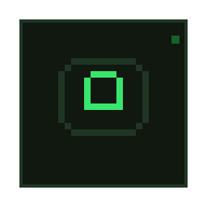

<p align="center">
  
</p>

<h1 align="center">Minecraft Server Customizer</h1>

<p align="center">
  A Windows desktop app for creating, customizing, running, and maintaining local Minecraft servers—without managing server files by hand.
</p>

<p align="center">
  <a href="https://github.com/MashaSupremacist/Minecraft-Server-Customizer/releases"></a>
  <a href="https://github.com/MashaSupremacist/Minecraft-Server-Customizer/actions/workflows/build-release.yml"></a>
  
  <a href="LICENSE"></a>
</p>

> [!IMPORTANT]
> **Regular users do not need Node.js, npm, or the source code.** Download a packaged application from [GitHub Releases](https://github.com/MashaSupremacist/Minecraft-Server-Customizer/releases) and run it directly.

## Download

### Portable EXE — recommended

1. Open [Releases](https://github.com/MashaSupremacist/Minecraft-Server-Customizer/releases).
2. Download **`Minecraft Server Customizer-Portable-x.y.z.exe`**.
3. Double-click the downloaded file. No installation is required.

The portable executable is self-contained. Application data, servers, backups, and downloaded runtimes remain under your Windows user profile rather than beside the executable.

### Installer

If you prefer desktop and Start Menu shortcuts, download **`Minecraft Server Customizer-Setup-x.y.z.exe`** instead.

> [!NOTE]
> Current builds are unsigned. Windows SmartScreen may show an **Unknown publisher** warning on first launch. Code signing is planned for a future release.

## What it can do

| Area | Capabilities |
| --- | --- |
| Server types | Vanilla, Fabric, Forge, Paper, and Bedrock Dedicated Server |
| Installation | Version discovery, server download, verification, EULA flow, and starter configuration |
| Runtime | Start, stop, restart, force-kill, state tracking, and crash detection |
| Console | Live logs, filtering, command history, command input, and log export |
| Configuration | Friendly Java and Bedrock settings editors plus raw-file editing |
| Players | Whitelist, operators, bans, Bedrock allowlist, and permission levels |
| Worlds | Local world discovery and import |
| Extensions | Fabric/Forge mods, Paper plugins, datapacks, behavior packs, and resource packs |
| Safety | ZIP backups, restore, retention controls, and pre-change backups |
| Connectivity | Playit tunnel integration |
| Java | Detect an existing Java installation or install a private runtime without changing system `PATH` |

## Designed for local control

- Server processes run directly on your computer.
- The local backend binds only to `127.0.0.1` and uses a random per-launch authentication token.
- Server data is not committed to this repository.
- Java runtimes installed by the app are private to Minecraft Server Customizer.
- External links open in your normal system browser.

Packaged application data is stored under:

```text
%APPDATA%\@msc\desktop\app-data
```

Uninstalling the desktop application does not automatically delete that server data.

## Verify a download

Every GitHub Release includes `SHA256SUMS.txt`. From Git Bash, compare the published checksum with your download:

```sh
sha256sum "Minecraft Server Customizer-Portable-0.1.0.exe"
```

## Development

The following requirements are for contributors only:

- Windows 10/11
- Node.js 20 or newer
- npm 10 or newer

Install dependencies and launch the development build:

```sh
npm install --include=dev
npm run dev
```

### Quality checks

```sh
npm run typecheck
npm test
npm run build
```

### Create distributable builds

The packaged backend uses a bundled `node.exe` so its native SQLite dependency has a compatible runtime. On a fresh local checkout, stage the current Node executable before packaging:

```sh
mkdir -p apps/desktop/resources/bin
cp "$(dirname "$(which node)")/node.exe" apps/desktop/resources/bin/node.exe
CSC_IDENTITY_AUTO_DISCOVERY=false npm run dist
```

Output is written to `release/`:

```text
release/
  Minecraft Server Customizer-Setup-x.y.z.exe
  Minecraft Server Customizer-Portable-x.y.z.exe
  Minecraft Server Customizer-Portable-x.y.z.zip
```

## Project layout

```text
apps/
  desktop/
    electron/    Electron main process and preload bridge
    renderer/    React + Vite user interface
    backend/     Fastify + SQLite local backend
    build/       Application icon and build resources
packages/
  shared-types/  Shared renderer, IPC, and backend contracts
scripts/
  make-portable-zip.mjs
  prepare-backend-deps.mjs
.github/workflows/
  build-release.yml
```

## Automated releases

Pushing a version tag runs the Windows release workflow. It type-checks, tests, builds, packages, computes SHA-256 checksums, and attaches the installer and portable downloads to a GitHub Release.

```sh
git tag v0.1.0
git push origin v0.1.0
```

## Security model

- Electron `contextIsolation: true`
- Electron `nodeIntegration: false`
- Sandboxed renderer
- Narrow `contextBridge` API
- Local backend bound to `127.0.0.1`
- Per-launch random backend token
- Child processes started without a shell where possible
- Download checksums verified when upstream metadata provides them
- ZIP extraction protects against path traversal

Please report security-sensitive issues privately rather than posting exploit details in a public issue.

## Documentation

- [Implementation progress](PROJECT_PROGRESS.md)
- [Original implementation plan](MINECRAFT_SERVER_CUSTOMIZER_PLAN.md)

## License

Released under the [MIT License](LICENSE).
